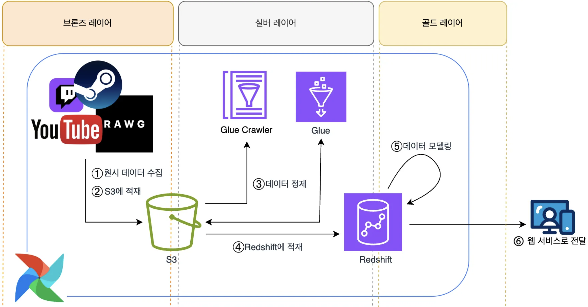
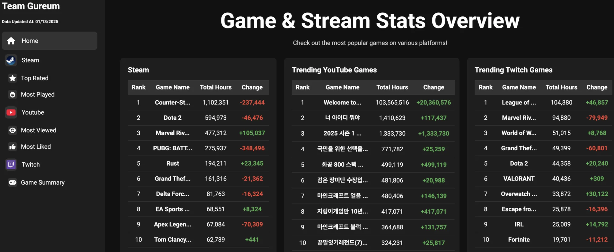

### Game-Stream-Trends
---

# 📋 프로젝트 개요
**AWS 기반 데이터 엔지니어링 파이프라인**을 구축하여 데이터를 수집, 처리, 저장, 분석하는 과정을 자동화 
게임 데이터와 스트리밍 플랫폼 데이터를 결합해 인기 게임 트렌드 분석 및 플랫폼별 주요 지표 변화를 추적하고, 이를 통해 의미 있는 인사이트를 제공하는 것이 목표

### 주제
게임과 스트리밍 트렌드 분석

### 목표
1. **인기 게임 분석**: 게임 데이터와 스트리밍 플랫폼 데이터를 결합해 트렌드 도출
2. **트렌드 변화 추적**: 플랫폼별 주요 지표를 정의하고 변화 추적
3. **사용자 및 시청자 비교**: 실제 게임 사용자 수와 스트리밍 플랫폼 시청자 수 간의 인사이트 제공
4. **기술역량 강화**: 데이터 엔지니어링 기술 숙련도 향상 및 협업 경험 확대

### 기술 스택
| **분류**             | **활용 기술 스택**                                                         |
|----------------------|----------------------------------------------------------------------|
| **클라우드 / 인프라** | `AWS (S3, EC2, Load Balancer, Redshift, Glue, RDS, ElastiCache)`   |
| **데이터 파이프라인** | `Python`, `Airflow`, `PySpark`                                      |
| **CI/CD**            | `GitHub Actions`                                                   |
| **웹 서버 / 배포**    | `React`, `FastAPI`, `Nginx`                                         |
| **프로젝트 관리**      | `GitHub Projects`, `Notion`, `Slack`, `Discord`, `ZEP`
 
 

# 🔄 데이터 파이프라인 아키텍처

### 데이터 흐름
`API -> S3 -> Glue -> S3 -> Redshift -> Web Service`
1. 원시 데이터는 API를 통해 수집된 후 S3에 원본 그대로 저장
2. 이후 Glue Crawler와 Glue Spark Job을 활용해 데이터를 정제하고 변환하며 결과는 S3에 다시 저장
3. 마지막으로 Redshift에 적재하여 분석과 집계를 수행하고, 최종 결과를 웹 서비스에서 활용

### 레이어별 역할
| **레이어** | **저장 위치** | **데이터 형식**           | **주요 내용**                           |
|------------|---------------|---------------------------|-----------------------------------------|
| **브론즈** | S3            | JSON                      | 원본 데이터 저장 - 정제되지 않은 상태  |
| **실버**   | Redshift      | 정형화 테이블            | 데이터 정제 및 구조화 - 분석 준비 단계 |
| **골드**   | Redshift      | 집계 및 분석된 정형화 테이블 | 집계 및 분석 결과 데이터 - 최종 활용 단계 |
 
 

# 🌐 AWS 아키텍처

### 주요 구성 요소
| **구성 요소**          | **설명**                                               |
|------------------------|-------------------------------------------------------|
| **VPC**   | AWS 리소스를 격리하고 보안을 강화하기 위해 사용         |
| **퍼블릭 서브넷**       | Bastion Host와 웹 서버 컴포넌트를 배치                  |
| **프라이빗 서브넷**     | 데이터 파이프라인 리소스를 배치 (Airflow, Redis, RDS 등) |
| **S3 엔드포인트**       | S3와의 데이터 트래픽을 안전하게 관리                    |
| **CI/CD**              | GitHub Actions를 활용한 DAG 및 웹 서버 자동 배포         |
 
 

# 프로젝트 성과
- 데이터를 수집 및 분석할 수 있는 데이터 파이프라인과 웹 서비스를 성공적으로 구축
- 웹 페이지의 홈 화면에서 플랫폼별 주요 지표 변화를 추적하는 대시보드를 구현하여 현재 플랫폼별 트렌드를 효과적으로 제시
- 각 플랫폼의 탭 화면에서는 다양한 지표 변화를 추적하는 대시보드 구현

### 플랫폼별 Summary 페이지 (홈 화면)
**Home**

이외에는 [docs/images/web_service/](https://github.com/gureums/Game-Stream-Trends/tree/main/docs/images/web_service)에 있음
