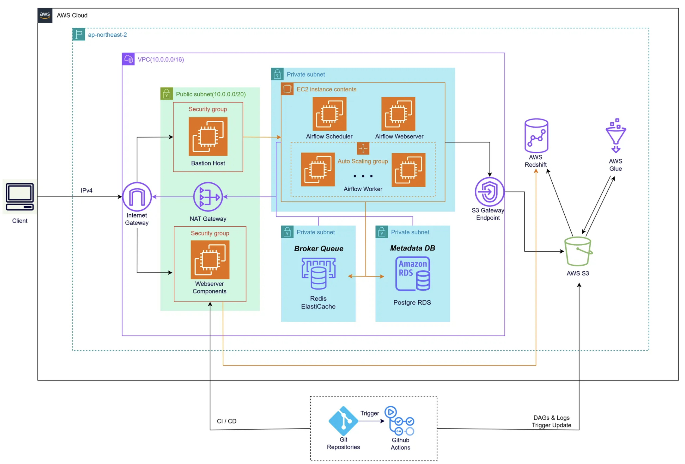

# 🌐 AWS 아키텍처

- VPC와 서브넷 구성 (퍼블릭, 프라이빗 분리)
- 데이터 파이프라인 리소스 (Airflow, Redis ElastiCache, PostgreSQL RDS)

### 주요 구성 요소
| **구성 요소**          | **설명**                                               |
|------------------------|-------------------------------------------------------|
| **VPC**   | AWS 리소스를 격리하고 보안을 강화하기 위해 사용         |
| **퍼블릭 서브넷**       | Bastion Host와 웹 서버 컴포넌트를 배치                  |
| **프라이빗 서브넷**     | 데이터 파이프라인 리소스를 배치 (Airflow, Redis, RDS 등) |
| **S3 엔드포인트**       | S3와의 데이터 트래픽을 안전하게 관리                    |
| **CI/CD**              | GitHub Actions를 활용한 DAG 및 웹 서버 자동 배포         |